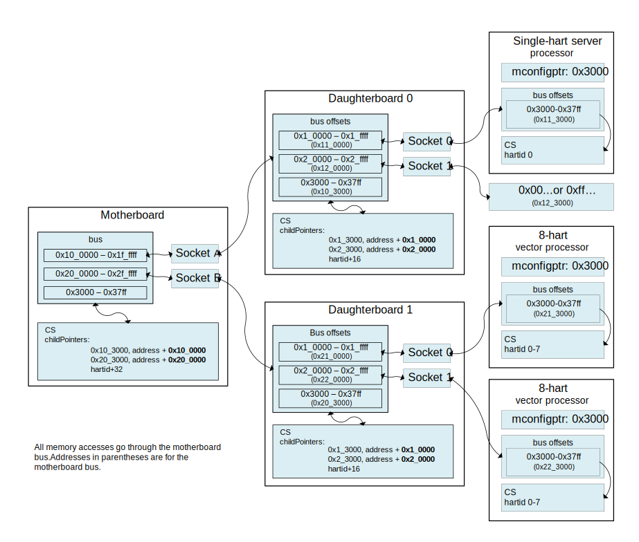

[[riscv-doc-template]]
:description: The software discovery configuration specification
:company: RISC-V International
:revdate:  January 5, 2022
:revnumber: 0.1.0
:revremark: This document is in Development state.  Change should be expected.
:url-riscv: http://riscv.org
:doctype: book
:preface-title: Preamble
:colophon:
:appendix-caption: Appendix
:title-logo-image: image:docs-resources/images/risc-v_logo.svg[pdfwidth=3.25in,align=center]
// Settings:
:experimental:
:reproducible:
:WaveDromEditorApp: wavedrom-cli
:icons: font
:lang: en
:listing-caption: Listing
:sectnums:
:sectnumlevels: 5
:toclevels: 5
:toc: left
:source-highlighter: pygments
ifdef::backend-pdf[]
:source-highlighter: coderay
endif::[]
:data-uri:
:hide-uri-scheme:
:stem: latexmath
:footnote:
:xrefstyle: short

= RISC-V Configuration Description Version {revnumber}

//:This is the preamble.

[NOTE]
.Copyright and licensure:
====
This work is licensed under a
link:http://creativecommons.org/licenses/by/4.0/[Creative Commons Attribution 4.0 International License].

This work is Copyright 2022 by RISC-V International.
====

Contributors to all versions of the spec in alphabetical order (please
contact editors to suggest corrections):

* Abner Chang <abner.chang@hpe.com>, Hewlett Packard Enterprise
* Tim Newsome <tim@sifive.com>, SiFive, Inc

== Preface

[WARNING]
.This document is in the link:http://riscv.org/spec-state[Development state]
====
Assume everything can change.  This draft specification will change before being accepted as
standard, so implementations made to this draft specification will
likely not conform to the future standard.
====

== Background

It is generally useful for software to be able to programmatically
determine the capabilities of the hardware it is running on.
Software needs to discover core and hart feature availability so it can take
advantage of all of them.
External debuggers need to know the same information so they can present an
appropriate user interface.
RISC-V extensions mostly
use CSRs for this information, but that is not flexible enough for some
kinds of data like hardware breakpoint capabilities, and cache
hierarchy.

This document specifies syntax, semantics, discovery method, and access
method for a static data structure that can accommodate implementation
parameters of RISC-V standards beyond what can be easily put into CSRs.
The structure is called a Configuration Structure (CS).

=== Use Cases

==== System Firmware

Typical system firmware is executed when the system is powered on. It
initializes hardware and builds up firmware services or data structures
for booting up the system to OS.
Examples are U-Boot for embedded systems, and BIOS (majority firmware solution
is UEFI TianoCore) for PCs and servers.

Through a combination of checking CSRs and accessing the system
description, firmware can
programmatically determine the hardware capabilities and configure
hardware accordingly. These hardware capabilities can include
availability and implemented features of Physical Memory Protection
(PMP), Core Local Interrupt Controller (CLIC), Core Local Interruptor
(CLINT), memory map, virtual memory, Trusted Execution Environment
(TEE), and any future optional core and hart features.

The Configuration Structure is an efficient alternative to testing for
specific hardware features (including handling failures) or customizing
system firmware for the specific system it will run on.

Often system firmware will take the information it has learned from the
Configuration Structure as well as through other methods, and encode it into
a different industry-standard data structure like Devicetree, SMBIOS, or
ACPI. This structure is then passed to the subsequent boot process.

==== External Debuggers

When an external debugger connects to a system, it would like to
discover as much as possible about that system in as little time as
possible. Some of this is merely to show the user (e.g. a manufacturer
name), while other features are critical to the user (e.g. XLEN), and
other features determine what kind of operations the user can perform
(e.g. supported hardware trigger types). Most of these are already
discoverable, although many require writing a value and checking the
result to see whether support exists.

Any structure that's accessible from M-mode software will already be
accessible by the debugger. There might be a structure embedded in the
Debug Module itself which is only accessible by the debugger.

The debug feature that is most complex to describe is hardware triggers.
Each hart may have billions of triggers (although 4 is more typical).
Each of those triggers can be one of 4 types, and each type has its own
options. Options are things like trigger on execute/load/store, in M/S/U
mode, chain to other trigger, exact/greater/less-than value match, etc.
It's permissible for features to be implemented, but not in all
combinations. E.g. greater value might work in combination with
load/store, but not together with executed. Each trigger is configured
by writing an XLEN-bit register.

In addition there are abstract commands, which have similar issues.
There are a few commands, with a number of options.

=== Off-line Development Tools

A lot of development happens without access to the hardware, and software as
well as hardware development tools can benefit from having a standardized
description of hardware features to work from.

== Configuration Structure Schema

The Configuration Structure schema describes what implementation decisions can
be put into the Configuration Structure, and how that data is encoded in the
binary format.  The schema is organized by RISC-V extension, and can itself be
extended in a backwards-compatible way.

The schema is written using https://www.itu.int/rec/T-REC-X.680/en[ASN.1 basic
notation and constraints]. The schema itself is part of this specification, but
resides separately in github, and includes all the files under
https://github.com/riscv/configuration-structure/tree/master/schema. The
top-level type is Top, defined in
https://github.com/riscv/configuration-structure/blob/master/schema/configuration-structure.asn[configuration-structure.asn].

=== Schema Best Practices

ASN.1 is extremely flexible. Below are some rules of thumb that impose
limitations on its use that work best for the Configuration Structure use case:

1. All BOOLEANs should default to FALSE. This allows users to omit the value from
their description and have it act as if it's set to FALSE explicitly. This does
not affect the encoding at all. Example: `m BOOLEAN DEFAULT FALSE`
2. Constrain INTEGERs with a lower bound if possible. This can save a bit in the
encoding. Example: `id INTEGER (0..MAX)`
3. If the upper bound of an INTEGER is less than 256 times larger than the
typical used value, or the upper bound is less than 65536, then constrain both
the upper and lower bound of that INTEGER.
INTEGERs that have no upper bound incur at least 1
byte in overhead when encoded. Example: `maskmax INTEGER (0..63)`
4. Constrain SEQUENCE OF if they'll be small. Example: `single SEQUENCE
SIZE(1..8) OF Integer3 OPTIONAL`
5. Add extension markers to your types unless you're really sure that we'll
never want to add anything else to the type. If unused, it adds just 1 bit of
overhead. Example: `SEQUENCE { id INTEGER (0..15), \... }`
6. Define your types in such a way that it is hard or impossible to specify
invalid configurations.

== Human-Readable Format

ASN.1 defines a value syntax, but it's not well-supported among open source
solutions. For now we'll use https://www.itu.int/rec/T-REC-X.697/en[ASN.1
((JER))] as the human-readable format for the content of Configuration Structure.
JER is a JSON representation of the ASN.1 value.
The Human-Readable format is backward compatible when new extensions
are introduced to Configuration Structure schema.

In the future, we should be able to accept YAML with little extra work, and the
big immediate benefit of a format that supports comments.

== Machine-Readable Format

The human-readable format is encoded to the binary using the standardized
unaligned packed encoding rules (unaligned PER,
see https://www.itu.int/rec/T-REC-X.691/en[ASN.1 ((UPER))], which is very compact.
The binary format is backward compatible when new extensions are introduced
into Configuration Structure schema.

[[sec:AccessMethod]]
=== Access Method

The binary Configuration Structure is memory-mapped in system memory.
mconfigptr contains the physical address where the structure starts.
When software running on a hart wants to read the Configuration Structure, it
reads mconfigptr, and then decodes the binary structure at that physical address.
The structure will specify which parts apply to which harts (identified by hart
ID), and the software can ignore any information that does not apply to the hart
it's running on.

image::resources/images/mconfigptr.svg[Access Method to Applications]

The above figure is a common example. Storage and provisioning of the
Configuration Structure is implementation-specific and beyond the scope of this
specification.

There could be a single system-wide CS, or a more complex arrangement for either
single core or multicore systems, using the ChildStructure type discussed in the
section <<_configuration_structure_pointers>>.

== Contents of Configuration Structure

The Configuration Structure contains a static description of a hardware
platform, following the format descriped in the schema.
It describes, in varying levels of detail, the
implementation decisions made by the hardware designer. The description is
static and is not affected by the current state of the system.

=== Information Detail

Some specifications have just a handful of design decisions, and it's easy to
add them all into the configuration structure. Others have a lot of design
decisions, and not all of them need to be in every CS in order to save space.

To accommodate minimal on-chip descriptions on small systems and larger
descriptions for other use cases, implementation decisions are divided into
the following three categories:

1. ((Primary)) information is only discoverable by reading the configuration
structure, or by running a significant amount of code. Example: the number of
hardware triggers supported
2. ((Secondary)) information is discoverable but not straightforward (e.g. WARL
register). Example: whether the F extension is supported
3. Anything else goes in the ((Complete)) section. Example: the value of XLEN

The schema should be able to encode all of those types information. If the
distinction is made, then small CSs might only include the Primary information,
while larger CSs would also include the Secondary and Complete information.

=== Configuration Structure Pointers

There are some cases where it is easier to have multiple CSs than a single one.
For systems with sockets this is the only solution because it cannot be known at
design time what is inserted into each socket. For systems that combine IP from
multiple vendors it might also be easier to have each vendor provide a CS for
its component instead of combining them all into a single CS.

When components are inserted into sockets, they often adjust their identity
based on a few pins that are part of the socket standard. Because of the CS's
binary format, even a small change in the contents can result in a very large
change in the overall structure. This section outlines a solution to this
problem which does not rely on changing the CS based on which socket a component
is inserted into (although that is also an allowable implementation).

To accommodate systems that are built by combining multiple components, each
with their own CS, the schema supports pointers to other Configuration
Structures. These CSs are organized in a tree, with a top-level CS which points
to child CSs, which in turn can point to further child CSs. A parser can
discover the full tree by starting at the CS pointed to by mconfigptr, following
Configuration.ancestorPointer until it finds a CS where that is missing, and then
recursively visit each child CS pointed to in Configuration.childPointers.

The system must ensure that reads at the addresses pointed to by any
ancestorPointer or childPointer result in:

1. a valid CS, OR
2. 8 bytes whose value is 0, OR
3. 8 bytes whose value is 0xff, OR
4. an exception.

ChildStructure contains several Translation types that change how the values in
the child CS are interpreted. These translations are applied recursively to all
addresses and hart IDs mentioned in the child CSs.
They exist so that the CS can be baked into the hardware while still allowing a
parser to know where in the final system those pieces fit in.

=== Conflicting Information

A CS might contain conflicting information, but such a CS is not valid, and
must not be created or used.

Conflicts occur when an element in a type describing a component has one value,
and then later that same element in a different type describing that same
component has another value. OPTIONAL elements can be missing in one description
and be present in another. That is not a conflict.

(Checking whether a CS contains conflicting information can be automated, but it
currently is not.)

=== Implementation Examples

There are several options for embedding the binary structure:

1. The structure can describe all harts, and be accessible over the memory bus.
All harts have the same memory map and the same value in mconfigptr.
2. There might be several structures in the system, and different harts are
pointed to different structures by having different pointers in mconfigptr.
3. There might be several structures in the system. Each hart has the same
address in mconfigptr. The memory system provides a different configuration
structure at that address depending on which hart is performing the access.
4. A combination of 2 and 3 above could be used.

Hardware implementers have a lot of flexibility to handle everything from simple
fixed systems to complex socketed systems. In each case it's straightforward to
ensure that each hart can read a Configuration Structure that describes its own
capabilities.

== Examples

This section gives examples of how the Configuration Structure might be used.
It is not part of the specification, but should help illustrate the
specification's intent.

=== Socketed System

Let's work through a complicated example, in a system that looks as follows:

Each component has its own CS, and might implement other memory-mapped
peripherals. The hardware combines all the buses in the diagram into a single
system memory map, which looks as follows:
[cols="1,2"]
|===
|Address|Device

|0x3000 -- 0x37ff | Motherboard Configuration Structure
|0x10_3000 -- 0x10_37ff | Daughterboard 0 Configuration Structure
|0x11_3000 -- 0x11_37ff | Single-hart server processor CS
|0x12_3000 -- 0x12_37ff | No CS because the socket is unpopulated
|0x20_3000 -- 0x20_37ff | Daughterboard 1 Configuration Structure
|0x21_3000 -- 0x11_37ff | 8-hart vector processor CS
|0x22_3000 -- 0x12_37ff | 8-hart vector processor CS
|===

Similarly, the hardware uses pin strapping to ensure hart IDs are globally
unique. The single-hart server processor ends up with hartid 0, while the vector
processors end up with hartid 32--39 and 48--55 respectively.

These translations are listed in the static CS, so the parser can correctly
identify every global address and hartid mentioned in any of the CSs.

Part of the socket standard is the fact that the root CS exists at 0x3000. So a
parser, regardless of which hart it's running on, will see.

When the parser runs, it first parses the motherboard CS (which is pointed to by
mconfigptr). Then it follows each childPointer, tracking address and hartid
translations. E.g. when it parses the CS at 0x20_3000, the parser will add
0x20_0000 to any address that it sees, and 32 to any hartid that it sees. When
it parses the CS at 0x21_3000 it will add 0x20_0000 + 0x1_0000 to any address
that it sees, since the translations are applied recursively.

[[sec:ExternalIndustrialStandard]]
== External Industrial Standards

https://www.devicetree.org/specifications/[DeviceTree v0.3] +
https://uefi.org/specifications[ACPI v6.3] +
https://www.dmtf.org/standards/smbios[SMBIOS v3.5.0] +
https://github.com/riscv/riscv-smbios/blob/master/riscv-smbios.adoc[RISC-V SMBIOS Type 44H]

[index]
== Index
