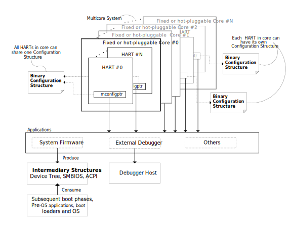

:version: 0.1.0
:sectnums:
:sectnumlevels: 5
:toclevels: 5
:toc: left

= RISC-V Configuration Description Version {version}

Contributors to all versions of the spec in alphabetical order (please
contact editors to suggest corrections): TODO

== Preface

*Warning! This draft specification will change before being accepted as
standard, so implementations made to this draft specification will
likely not conform to the future standard.*

== Rationale

It is generally useful for software to be able to programmatically
determine the capabilities of the hardware it is running on. The
software needs the information to discover the core and hart feature
availability for executing the different initialization code paths,
particularly when the software runs on a socketed system that supports
the pluggable cores. External
debuggers need to know the same information. RISC-V extensions mostly
use CSRs for this information, but that is not flexible enough for some
kinds of data like hardware breakpoint capabilities, and cache
hierarchy.

This document specifies syntax, semantics, discovery method, and access
method for a static data structure that can accommodate implementation
parameters of RISC-V standards beyond what can be easily put into CSRs.
The structure is called a Configuration Structure (CS).

== Use Cases

=== System Firmware

Typical system firmware is executed when the system is powered on. It
initializes hardware and builds up firmware services or data structures
for booting up the system to OS. Examples are uboot for embedded
systems and BIOS (majority firmware solution is UEFI TianoCore) for PCs
and servers, or other firmware framwworks.

Through a combination of checking CSRs and accessing the system
description, firmware can
programmatically determine the hardware capabilities and configure
hardware accordingly. These hardware capabilities can include
availability and implemented features of Physical Memory Protection
(PMP), Core Local Interrupt Controller (CLIC), Core Local Interruptor
(CLINT), memory map, virtual memory, Trusted Execution Environment
(TEE), and any future optional core and hart features.

The Configuration Structure is an efficient alternative to testing for
specific hardware features (including handling failures) or customizing
system firmware for the specific system it will run on.

Often system firmware will take the information it has learned from the
system description as well as through other methods, and encode it into
a different industry-standard data structure (like Devicetree, SMBIOS and
ACPI). This structure is then passed to the subsequent boot process.

=== External Debuggers

When an external debugger connects to a system, it would like to
discover as much as possible about that system in as little time as
possible. Some of this is merely to show the user (e.g. a manufacturer
name), while other features are critical to the user (e.g. XLEN), and
other features determine what kind of operations the user can perform
(e.g. supported hardware trigger types). Most of these are already
discoverable, although many require writing a value and checking the
result to see whether support exists.

Any structure that’s accessible from M-mode software will already be
accessible by the debugger. There might be a structure embedded in the
Debug Module itself which is only accessible by the debugger.

The debug feature that is most complex to describe is hardware triggers.
Each hart may have billions of triggers (although 4 is more typical).
Each of those triggers can be one of 4 types, and each type has its own
options. Options are things like trigger on execute/load/store, in M/S/U
mode, chain to other trigger, exact/greater/less-than value match, etc.
It’s permissible for features to be implemented, but not in all
combinations. E.g. greater value might work in combination with
load/store, but not together with executed. Each trigger is configured
by writing an XLEN-bit register.

In addition there are abstract commands, which have similar issues.
There are a few commands, with a number of options.

=== Off-line Development Tools

A lot of development happens without access to the hardware, and software as
well as hardware development tools can benefit from having a standardized
description of hardware features to work from.

== Representation of Configuration Structure 

=== Schema of Configuration Structure

The schema of Configuration Structure is the data structure that declares
the data format which can be used to describe the configuration of core
and hart features. The schema is typically grouped by the extension
and flexibly support the next generation of extensions.

To accommodate minimal on-chip descriptions on small systems and larger
descriptions for other use cases, implementation decisions are divided into
the following three categories:

1. ((Primary)) information is only discoverable by reading the configuration
structure, or by running a significant amount of code. Examples: the number of
hardware triggers supported, ...
2. ((Secondary)) information is discoverable but not straightforward (e.g. WARL
register). Examples: whether the F extension is supported, ...
3. Anything else goes in the ((Complete)) section. Examples: the value of XLEN,
...

The schema is written using https://www.itu.int/rec/T-REC-X.680/en[ASN.1 basic
notation and constraints]. The schema itself is part of this specification, but
resides separately in github, and includes all the files under
https://github.com/riscv/configuration-structure/tree/master/schema. The
top-level type is Top, defined in
https://github.com/riscv/configuration-structure/blob/master/schema/configuration-structure.asn[configuration-structure.asn].

==== Schema Best Practices

ASN.1 is extremely flexible. Below are some rules of thumb that impose
limitations on its use that work best for the configuration structure use case:

1. All BOOLEANs should default to FALSE. This allows users to omit the value from
their description and have it act as if it's set to FALSE explicitly. This does
not affect the encoding at all. Example: `m BOOLEAN DEFAULT FALSE`
2. Constrain INTEGERs with an upper and lower bound if possible, if the upper
bound is less than 256 times larger than the typical used value or the upper
bound is less than 65536.  INTEGERs that have no upper bound incur at least 1
byte in overhead when encoded. Example: `maskmax INTEGER (0..63)`
3. Constrain INTEGERs with a lower bound if possible. This can save a bit in the
encoding. Example: `id INTEGER (0..MAX)`
4. Constrain SEQUENCE OF if they'll be small. Example: `single SEQUENCE
SIZE(1..8) OF Integer3 OPTIONAL`
5. Add extension markers to your types unless you're really sure that we'll
never want to add anything else to the type. If unused, it adds just 1 bit of
overhead. Example: `...`
6. Define your types in such a way that it is hard or impossible to specify
invalid configurations.

=== Contents of Configuration Structure

The Configuration Structure contains a static description of a hardware
platform. The static descriptions are the values that made follow the
schema of Configuration Structure. It describes, in varying levels of detail, the
implementation decisions made by the hardware designer. The description is
static and is not affected by the current state of the system.

==== Configuration Structure Pointers

To accommodate systems that are built by combining multiple components, each
with their own CS, the schema supports pointers to other Configuration
Structures. These CSs are organized in a tree, with a top-level CS which points
to child CSs, which in turn can point to further child CSs. A parser can
discover the full tree by starting at any CS, following
Configuration.ancestorPointer until it finds a CS where that is missing, and then
recursively visit each child CS pointed to in Configuration.childPointers.

Let's work through a complicated example, in a system that looks as follows:

* A motherboard
** Daughterboard socket 0 mapped at 0x10_0000, with a server module plugged into it
*** CPU Socket 0 mapped at 0x11_0000, with a single-hart server processor plugged into it
*** CPU Socket 1 mapped at 0x12_0000, left empty
** Daughterboard socket 1 mapped at 0x20_0000, with a vector math module plugged into it
*** CPU Socket 2 mapped at 0x21_0000, with an 8-hart vector processor plugged into it
*** CPU Socket 3 mapped at 0x22_0000, with an 8-hart vector processor plugged into it

Each component has its own CS. (Let's pretend there's something useful the CS
can describe about each component.) Each component also has access to a
system-wide bus, and implements some memory-mapped peripherals. The mappings
shown are into the system-wide address space, although it happens in stages.
I.e. each daughterboard maps its second socket to 0x2_0000 locally, and the 
motherboard maps the second daughterboard to 0x2_00000, which results in CPU
Socket 3 having a global address of 0x22_0000.

The pointers in the various Configuration Structure look as follows:

* motherboard: CS @0x3000, childPointers=0x10_3000, 0x20_3000
** server module: CS @0x3000, ancestorPointer=0x3000, childPointers=0x1_0000, 0x2_0000
*** server processor: CS @0x3000, ancestorPointer=0x3000
** vector module: CS @0x3000, ancestorPointer=0x3000, childPointers=0x1_0000, 0x2_0000
*** vector processor 0: CS @0x3000, ancestorPointer=0x3000
*** vector processor 1: CS @0x3000, ancestorPointer=0x3000

If you combine this with the mappings listed previously, the system bus address of each CS is:

* motherboard: 0x3000
* server module: 0x10_3000
* server processor: 0x11_3000
* vector module: 0x20_3000
* vector processor 0: 0x21_3000
* vector processor 1: 0x21_3000

At first glance this is impossible for the server processor to discover. Somehow
it needs to know what address mappings are in place. To solve this problem,
ChildStructure contains addressTranslation which describes how each address in
the child CS should be translated. With translations, the CSs become:

* motherboard: CS @0x3000, childPointers=0x10_3000 (translate: add 0x10_0000), 0x20_3000 (translate: add 0x20_0000)
** server module: CS @0x3000, ancestorPointer=0x3000, childPointers=0x1_0000 (translate: add 0x1_0000), 0x2_0000 (translate: add 0x1_0000)
*** server processor: CS @0x3000, ancestorPointer=0x3000
** vector module: CS @0x3000, ancestorPointer=0x3000, childPointers=0x1_0000 (translate: add 0x1_0000), 0x2_0000 (translate: add 0x1_0000)
*** vector processor 0: CS @0x3000, ancestorPointer=0x3000
*** vector processor 1: CS @0x3000, ancestorPointer=0x3000

How does the CS in each module know that an ancestor CS lives at 0x3000? It must
be part of the socket spec, just as the socket pinout is. Ideally this could be
standardized in e.g. a RISC-V server profile.

==== Human-Readable Format

ASN.1 defines a value syntax, but it's not well-supported among open source
solutions. For now we'll use https://www.itu.int/rec/T-REC-X.697/en[ASN.1
((JER))] which is a JSON representation of the ASN.1 value that used as
Human-Readable format for the content of Configuration Structure.
The Human-Readable format is backward compatible when new extensions
are introduced to Configuration Structure schema.

In the future, we should be able to accept YAML with little extra work, and the
big immediate benefit of a format that supports comments.

==== Machine-Readable Format

The Human-readable format is encoded to the binary using the standardized
unaligned packed encoding rules (unaligned PER,
see https://www.itu.int/rec/T-REC-X.691/en[ASN.1 ((UPER))], which is very compact.
The binray format is backward compatible when new extensions are introduced
to Configuration Structure schema.

[[sec:AccessMethod]]
== Access Method to Machine-Readable Format

The binary configuration structure is memory-mapped in system memory.
mconfigptr contains the physical address where the structure starts.
When software running on a hart wants to read the configuration structure, it
reads mconfigptr, and then decodes the binary structure at that physical address.
The structure will specify which parts apply to which harts (identified by hart
ID), and the software can ignore any information that does not apply to the hart
it's running on.

The above figure is a common example. The storage and provisioning of configuration structure is implementation-specific and beyond the scope of this specification. There could be a single system-wide configuration structure, or a more complex arrangement for either single core or multicore systems.

=== Implementation Examples

There are several options for embedding the binary structure:

1. The structure can describe all harts, and be accessible over the memory bus.
All harts have the same memory map and the same value in mconfigptr.
2. There might be several structures in the system, and different harts are
pointed to different structures by having different pointers in mconfigptr.
3. There might be several structures in the system. Each hart has the same
address in mconfigptr. The memory system provides a different configuration
structure at that address depending on which hart is performing the access.
4. A combination of 2 and 3 above could be used.

Hardware implementers have a lot of flexibility to handle everything from simple
fixed systems to complex socketed systems. In each case it's straightforward to
ensure that each hart can read a configuration structure that describes its own
capabilities.

[[sec:ExternalIndustrialStandard]]
== External Industrial Standards

https://www.devicetree.org/specifications/[DeviceTree v0.3] +
https://uefi.org/specifications[ACPI v6.3] +
https://www.dmtf.org/standards/smbios[SMBIOS v3.5.0] +
https://github.com/riscv/riscv-smbios/blob/master/riscv-smbios.adoc[RISC-V SMBIOS Type 44H]

[index]
== Index